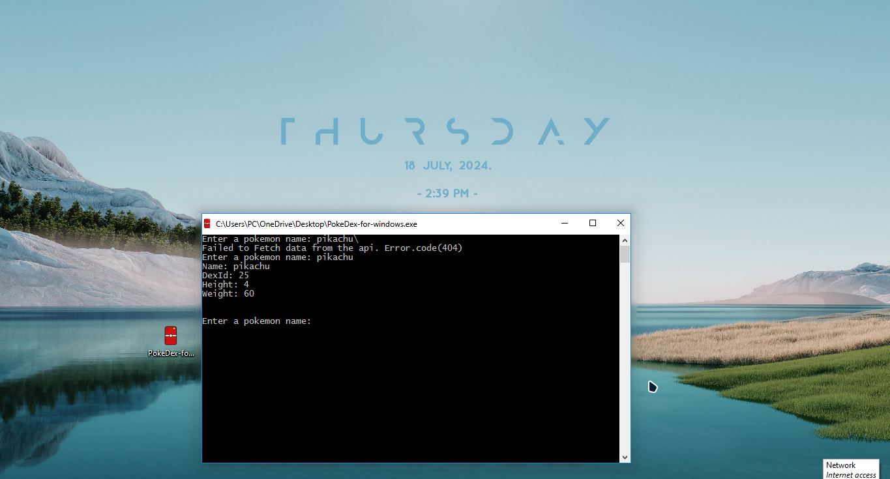

# PokeDex For Windows

**Release-1.0.0**

A real life equivalent of the pokedex for windows


## Author

- [@desh1310](https://www.github.com/desh1310)


## Installation

download the .exe file directly
or download using GIT bash

```bash
  git clone Desh1310/PokeDex-for-Windows-1.0.0
```
    
## Screenshots



it's a cli based version of the app the gui version will be released...


## Features

- full gen 1 - 9 pokemon support
- consoled based
- Super Fast
- Only for Windows(7+ recommended)

